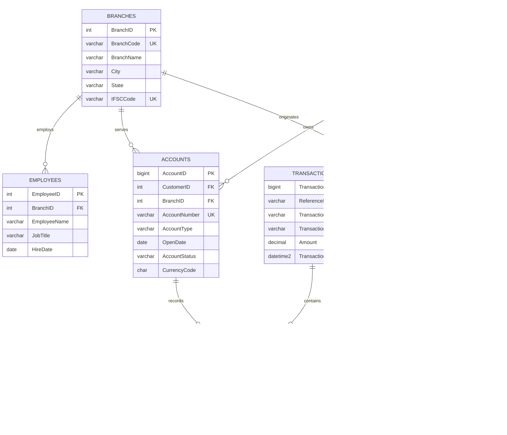

# BankCore ER Diagram

```mermaid
erDiagram
    BRANCHES ||--o{ EMPLOYEES : employs
    BRANCHES ||--o{ ACCOUNTS : serves
    BRANCHES ||--o{ LOANS : originates
    CUSTOMERS ||--o{ ACCOUNTS : owns
    CUSTOMERS ||--o{ LOANS : receives
    LOANS ||--o{ LOAN_PAYMENTS : has
    ACCOUNTS ||--o{ TRANSACTION_ENTRIES : records
    TRANSACTIONS ||--o{ TRANSACTION_ENTRIES : contains

    BRANCHES {
        int BranchID PK
        varchar BranchCode UK
        varchar BranchName
        varchar City
        varchar State
        varchar IFSCCode UK
    }

    CUSTOMERS {
        int CustomerID PK
        varchar FirstName
        varchar LastName
        date DateOfBirth
        varchar Email UK
        varchar Phone UK
        varchar KYCStatus
    }

    EMPLOYEES {
        int EmployeeID PK
        int BranchID FK
        varchar EmployeeName
        varchar JobTitle
        date HireDate
    }

    ACCOUNTS {
        bigint AccountID PK
        int CustomerID FK
        int BranchID FK
        varchar AccountNumber UK
        varchar AccountType
        date OpenDate
        varchar AccountStatus
        char CurrencyCode
    }

    TRANSACTIONS {
        bigint TransactionID PK
        varchar ReferenceNumber UK
        varchar TransactionType
        varchar TransactionStatus
        decimal Amount
        datetime2 TransactionDate
    }

    TRANSACTION_ENTRIES {
        bigint EntryID PK
        bigint TransactionID FK
        bigint AccountID FK
        varchar EntryType
        decimal Amount
    }

    LOANS {
        bigint LoanID PK
        int CustomerID FK
        int BranchID FK
        varchar LoanType
        decimal PrincipalAmount
        decimal AnnualInterestRate
        int TermMonths
        date DisbursementDate
        varchar LoanStatus
    }

    LOAN_PAYMENTS {
        bigint PaymentID PK
        bigint LoanID FK
        date DueDate
        date PaidDate
        decimal AmountDue
        decimal AmountPaid
        varchar PaymentStatus
    }
```
